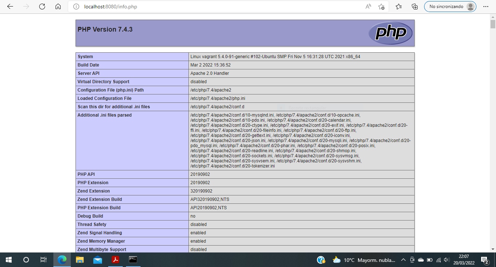

# despliegue-tema4

### Práctica: Preparar un servidor con apache2 + php + mariadb

Primero configuro una máquina virtual ubuntu 20 con vagrant
```
vagrant init bento/ubuntu-20.04
```
Edito el Vagrantile para hacer el forward del puerto 8080 al puerto 80

```
Vagrant.configure("2") do |config|
  config.vm.box = "bento/ubuntu-20.04"
  config.vm.network "forwarded_port", guest: 80, host: 8080
end
```
Levanto y actualizo el sistema
```
vagrant up
vagrant ssh
sudo apt update
```
Instalo el servidor de base de datos mariadb
```
sudo apt install mariadb-server
```
Instalo apache2 y el módulo que permite que apache2 interprete PHP
```
sudo apt install apache2 libapache2-mod-php php php-mysql
```
Creo el fichero info.php en el documentRoot (/var/www/html ?) con el siguiente contenido:
```
<?php phpinfo(); ?>
```
Compruebo el fichero desde el navegador y se muestra correctamente como se puede ver en la siguiente captura de pantalla:





### Práctica: Instalación de Wordpress
Levanto y actualizo el sistema
```
vagrant up
vagrant ssh
sudo apt update
```
Instalo el cliente de base de datos mariadb (no se instaló en la primera práctica)
```
sudo apt install mariadb-client
```
Accedo a la base de datos
```
sudo mysql -u root -p
```
Configuro la base de datos
```
create database wordpress;
use wordpress;
create user 'user'@'localhost';
grant all privileges on wordpress.* to 'user'@'localhost' identified by 'user';
flush privileges;
```
Copio la ruta de descarga desde la página de descarga de wordpress y lo descargo en el documentRoot (/var/www/html) con la herramienta wget
```
sudo wget https://es.wordpress.org/latest-es_ES.zip
```
Una vez descargado instalo unzip y lo descomprimo
```
sudo apt install unzip
sudo unzip latest-es_ES.zip
```
Hago propietario del documentRoot al usuario de apache www-data para que pueda grabar el fichero de configuración de la instalación directamente en el documentRoot
```
sudo chown -R www-data:www-data html/
```
Accedo al enlace de instalación
```
http://localhost:8080/wordpress/wp-admin/setup-config.php
```
Introduzco los detalles de la conexión
```
Nombre de la base de datos: wordpress
Nombre del usuario: user
Contraseña: user
Servidor de la base de datos: localhost
Prefijo de tabla: wp_
```
Ejecuto la instalación y relleno la información que solicita:
```
Título del sitio: Despliegue-tema4
Nombre de usuario: admin
Contraseña: adminDAW004
Tu correo electrónico: admin@exam.es
```
Hago login con las credenciales introducidas y accedo al panel de administración:

Accedo a wordpress desde http://localhost:8080/wordpress


### Práctica: Instalación de Drupal
##### - Descarga y configuración previa
Levanto y actualizo el sistema
```
vagrant up
vagrant ssh
sudo apt update
```
Copio la ruta de descarga  del paquete .tar.gz desde la página de descarga de drupal y lo descargo con la herramienta wget
```
wget --content-disposition https://www.drupal.org/download-latest/tar.gz
```
Extraigo el paquete que acabo de descargar directamente en la ruta que me interesa para la integración con el servicio web:
```
sudo tar xf drupal-9.X.X.tar.gz -C /var/www/
```
Como el nombre del nuevo subdirectorio creado contiene el número de versión en su nombre, creo un enlace simbólico sin números:
```
sudo ln -s /var/www/drupal-9.X.X /var/www/drupal
```
# Sustituye en el comando anterior 9.X.X por la versión que has descargado (la tecla tabulador ayudará con el autocompletado).
Cambio la propiedad del directorio de instalación y de su contenido al usuario con el que corre el servicio web en Ubuntu 20.04 ya que Drupal 9 necesita escribiren él
```
sudo chown -R www-data: /var/www/drupal/
```
##### - Servicio web
Activo los módulos de apache de los que podría hacer uso Drupal
```
sudo a2enmod expires headers rewrite
```
El uso de estos módulos se realiza a través de archivos .htaccess, que no son interpretados por defecto.
Añado al archivo de configuración que crearé para hacer la aplicación navegable a través de un alias
```
sudo nano /etc/apache2/sites-available/drupal.conf
```
El contenido queda así:
```
Alias /drupal /var/www/drupal
<Directory /var/www/drupal>
        AllowOverride all
</Directory>
```
Activo la configuración
```
sudo a2ensite drupal.conf
```
Reinicio el servicio web para aplicar todos los ajustes
```
sudo systemctl restart apache2
```
